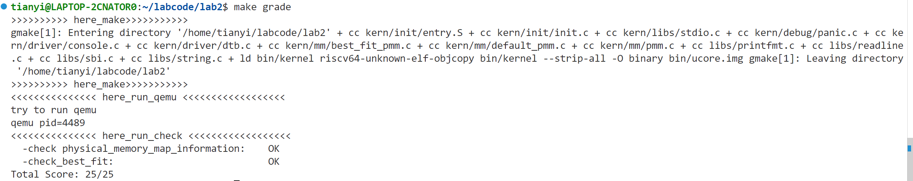

# Lab2

李天一（2313743） 王湜蔚（2313804） 黄尚扬（2313911）

## 练习1

### default_init - 初始化内存管理器

```c
static void
default_init(void) {
    list_init(&free_list);
    nr_free = 0;
}
```

调用list_init函数初始化双向循环链表free_list来存储空闲页面，先将空闲页面数量设为0。

### default_init_memmap - 初始化内存映射

```c
static void
default_init_memmap(struct Page *base, size_t n) {
    assert(n > 0);
    struct Page *p = base;
    // 初始化每个页面的元数据
    for (; p != base + n; p ++) {
        assert(PageReserved(p)); // 确保页面原本是保留状态
        p->flags = p->property = 0; // 清空所有标志位和属性字段
        set_page_ref(p, 0); // 页面引用计数设为0（未被使用）
    }
    // 设置这个空闲块的属性
    base->property = n; // 只在块的首页面记录整个块的大小
    SetPageProperty(base); // 标记这是空闲块首页
    nr_free += n; // 更新总空闲页面数
    // 按物理地址顺序插入空闲链表
    if (list_empty(&free_list)) { 
        // 如果链表为空，直接插入
        list_add(&free_list, &(base->page_link));
    } else {
        // 遍历链表找到合适的插入位置
        list_entry_t* le = &free_list;
        while ((le = list_next(le)) != &free_list) {
            struct Page* page = le2page(le, page_link);
            if (base < page) {
                // 找到第一个地址大于base的页面，插入到它前面
                list_add_before(le, &(base->page_link));
                break;
            } else if (list_next(le) == &free_list) {
                // 已经到链表末尾，插入到最后
                list_add(le, &(base->page_link));
            }
        }
    }
}
```

将一段连续的物理内存页初始化为可分配的空闲块并插入空闲链表：把这n个连续的页重置为干净、可用的状态，之后绑定为一整个空闲块，在块的第一页记录整个块的大小，并将该块按照物理地址顺序插入到空闲链表中。

### default_alloc_pages - 分配物理页面

```c
static struct Page *
default_alloc_pages(size_t n) {
    assert(n > 0);
    if (n > nr_free) {
        return NULL;
    }
    struct Page *page = NULL;
    list_entry_t *le = &free_list;
    // 寻找第一个大小>=n的块，找到后立即停止搜索
    while ((le = list_next(le)) != &free_list) {
        struct Page *p = le2page(le, page_link);
        if (p->property >= n) {
            page = p;
            break;
        }
    }
    if (page != NULL) {
        // 从空闲链表中移除这个块
        list_entry_t* prev = list_prev(&(page->page_link));
        list_del(&(page->page_link));
        // 如果块大于需求n，进行分割，将剩余块插回链表
        if (page->property > n) {
            struct Page *p = page + n; // 剩余块的起始页面
            p->property = page->property - n; // 剩余块的大小
            SetPageProperty(p); // 标记为空闲块首页
            list_add(prev, &(p->page_link)); // 将剩余块插回链表原位置
        }
        nr_free -= n; // 更新总空闲页面数
        ClearPageProperty(page); // 清除分配页面的属性标记，即PG_property清零，表示已分配
    }
    return page;
}
```

分配指定数量的连续物理页面：找到第一个满足大小的空闲块就停止，如果找到的块大于需求，将剩余部分作为新空闲块插入回空闲链表，更新页面计数和页面标志。

### default_free_pages - 释放物理页面

```c
static void
default_free_pages(struct Page *base, size_t n) {
    assert(n > 0);
    struct Page *p = base;
    // 验证并重置要释放的页面状态
    for (; p != base + n; p ++) {
        assert(!PageReserved(p) && !PageProperty(p)); // 确保不是保留页且已分配
        p->flags = 0; // 清空所有标志位
        set_page_ref(p, 0); // 页面引用计数设为0
    }
    // 设置释放块的属性
    base->property = n;
    SetPageProperty(base);
    nr_free += n;
    // 按地址顺序插入空闲链表
    // 与init_memmap实现相同···

    // 向前合并 - 检查前一个空闲块
    list_entry_t* le = list_prev(&(base->page_link));
    if (le != &free_list) {
        p = le2page(le, page_link);
        if (p + p->property == base) { // 检查地址是否连续
            p->property += base->property; // 合并块大小
            ClearPageProperty(base); // 清除原首页标记
            list_del(&(base->page_link)); // 从链表移除当前块
            base = p; // 指向合并后的块
        }
    }
    // 向后合并 - 检查后一个空闲块
    le = list_next(&(base->page_link));
    if (le != &free_list) {
        p = le2page(le, page_link);
        if (base + base->property == p) {
            base->property += p->property;
            ClearPageProperty(p); // 清除被合并块的首页标记
            list_del(&(p->page_link)); // 从链表移除被合并块
        }
    }
}
```

释放之前分配的物理页面，将其重新纳入空闲内存管理：将已分配的页面恢复为可用状态，设置释放块的属性，按照物理地址顺序将释放的块插入空闲链表，合并地址连续的块，减少内存碎片。

关于向前向后合并的区别，向前合并是合并到前一个块，所以要清除当前块的PG_property标志并删除节点，更新base指针指向前一个块；向后合并是将后一个块合并过来，所以要清除后一个块的PG_property标志并删除节点，base指针保持不变。其实本质上都是删除被合并块的标志和节点，让base指针指向合并块。

### 分配过程

初始化(default_init) → 映射(default_init_memmap) → 分配(default_alloc_pages) → 释放(default_free_pages)

各个函数的作用在分析时已经指出。

### 改进空间

搜索效率：采用Next-Fit策略或大小分类链表来减少遍历时间

碎片问题：设置分割阈值和定期整理来缓解

适应性：可引入动态策略切换机制，在First-Fit、Best-Fit等算法间动态切换

## 练习2

代码只修改了一处：分配页面时寻找合适的空闲块的逻辑，first_fit寻找第一个满足需求的内存块，而best_fit寻找满足需求的最小的内存块。其他部分与first_fit算法的实现一致。

```c
while ((le = list_next(le)) != &free_list) { // 关键修改
        struct Page *p = le2page(le, page_link);
        if (p->property >= n && p->property < min_size) {
            page = p;
            min_size = p->property;
        }
    }
```

循环遍历空闲链表中所有的空闲块，将链表指针le转换为完整的Page结构体指针，当块大小满足分配需求且小于min_size时，记录当前最佳块的指针，更新min_size为当前块大小，循环结束后就找到满足需求且最小的内存块。

如果找到的空闲块大于需求大小，将剩余部分分割为新的空闲块并插入回链表。释放内存时，将释放的页面重置状态并按地址顺序插回空闲链表，然后检查前后相邻块是否地址连续，如果是连续的则将它们合并成更大的空闲块。

使用make grade指令进行测试，输出结果如下：


first_fit的搜索速度很快，找到第一个满足要求的块就会停止，但是容易过早地分割大块的连续内存；best_fit的搜索速度较慢，需要遍历所有的空闲块选择大小最接近需求的那个，能较好地利用内存。

best_fit算法每次分配时都要遍历整个空闲链表，时间复杂度为O(n)，效率较低，而且会产生外部碎片，对此我们可以采用伙伴系统的分配算法，它将所有空闲内存划分为大小均为2的k次幂（如1, 2, 4, 8...页）的块，并为每一种大小的块维护一个独立的空间链表。时间复杂度降为O(logN)，有效避免了外部碎片的产生，不过会产生内部碎片，且降低了分配灵活性。
